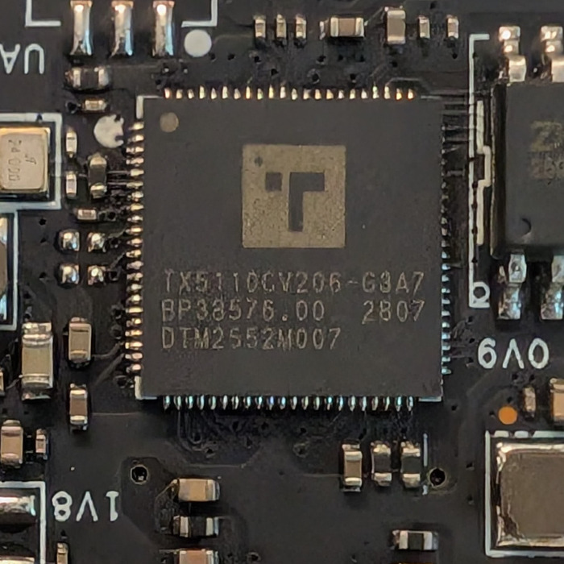
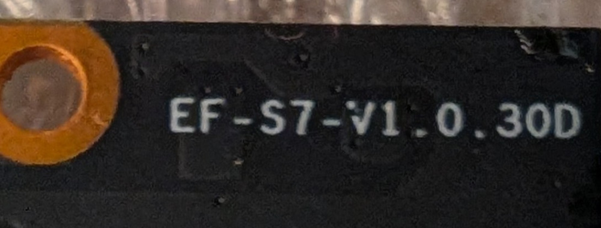
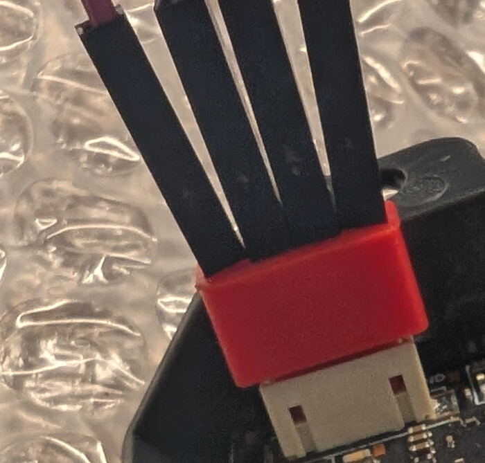

# Prevent or recover the Elegoo CC2 stock camera failure

Some stock Elegoo Centauri Carbon 2 cameras can stop working after repeated
printer power cycles. This repository provides ways to protect or recover
an affected camera:

- a working camera can receive a small startup fix through USB without
  flashing a firmware image;
- if there is too little free space to install that fix, use a same-camera
  backup to build and restore a preventive image through USB;
- a camera that no longer starts can be recovered from its own flash backup
  with an external programmer.

All routes preserve the identity of **your** camera. There is no generic
firmware image in this repository, and you must never write another camera's
dump to your device.

> **AI-development note:** This fix was developed with the assistance of AI.
> It has produced the expected result in two tested cases, but if you have any
> doubts, independently audit the tools before using them on your hardware.

## First identify your camera

The known failure affects one 8 MiB flash-layout variant of the
`EF-S7-V1.0.30B` camera family. An earlier 16 MiB 30B variant uses materially
different hardware and firmware. A newer `EF-S7-V1.0.30D` revision also uses
different hardware and software and is not affected by this particular
problem.

Do this identification before building a USB cable, buying a programmer, or
running a repair operation.

If the camera feed still works, start with the read-only stream check. Install
[`cc2camera`](docs/INSTALLATION.md), find the printer's IP address or hostname,
and run:

```sh
cc2camera identify-camera PRINTER
```

For example:

```sh
cc2camera identify-camera 192.168.1.50
```

This connects only to the printer's MJPEG camera stream on port 8080. It does
not use USB, HID or ADB and does not modify the printer or camera. The command
compares three consecutive JPEG encoder fingerprints with known 30B and 30D
signatures and refuses unknown or changing signatures rather than guessing.
The 30B signature has been observed on two independent known 30B cameras; the
30D signature has been observed on one known 30D camera. The stream identifies
the camera family, but cannot distinguish the early and affected 30B
flash-layout variants.

If the stream is unavailable, the signature is unknown, or you want authoritative
visual confirmation, inspect the hardware:

1. Power the printer off and unplug it from mains power.
2. Remove the camera module from the printer by undoing its single mounting
   screw, then unplug its four-wire cable.
3. Look at the large processor on the camera mainboard that's now in front of you.

If it is marked `TX5110`, the camera is likely the newer, unaffected family.
This recovery does not apply. If it is marked `Ingenic T23`, or the marking is
unclear, remove the two housing screws and check the complete PCB revision.



The four-digit PCB manufacturing code appears to use `WWYY` week/year order.
It is useful supporting evidence, but is not a safe cutoff on its own: component
or firmware changes may not align exactly with calendar weeks.

| Identification | Observed manufacturing codes | What is known |
|---|---|---|
| `EF-S7-V1.0.30B` / Ingenic T23 / 8 MiB `ZB25VQ64` family | `0226`, `0526` (two units), `1526` | This is the supported layout on which the failure has been observed. Continue below. |
| `EF-S7-V1.0.30B` / Ingenic T23 / 16 MiB `P25Q128H` family | `4025` | This early layout is materially different. The known erase defect has not been established on it, and the current fix does not apply. |
| `EF-S7-V1.0.30D` / likely TX5110 | Not established | This revision is not affected by the known failure. This guide does not apply. |
| Any other revision, processor or flash layout | Not established | It has not been investigated. We do not know whether it is affected, and this guide does not apply. |



Photographs of the `EF-S7-V1.0.30B` board are available in the
[OpenCentauri camera documentation](https://docs.opencentauri.cc/hardware/CC2/camera/).
The stream fingerprint is a convenient read-only family-identification aid.
The complete hardware markings and the tool's firmware and flash-layout checks
determine whether a 30B camera is supported. Never bypass a refusal because a
date code or stream signature appears to match.

## Choose the path that matches your camera

### The affected camera still works

Use the [USB prevention route](#working-camera-usb-prevention). It needs a
simple camera-to-USB cable but no SPI programmer.

### The affected camera no longer works

First check whether the fault is isolated to the camera:

1. Leave the stock camera disconnected.
2. While the printer is off, connect a known-working ordinary USB webcam to
   the printer's front USB port.
3. Power the printer on.

If the replacement webcam produces a feed, the stock camera is likely the
problem. Continue with the
[hardware recovery route](#failed-camera-hardware-recovery).

If the replacement webcam also fails, this test has not isolated the problem
to the stock camera. Stop this camera-recovery procedure.

> **Temporary replacement:** Once the stock camera is disconnected, most
> ordinary USB webcams can be used in the front USB port while you wait for a
> replacement or decide whether to attempt recovery. Connect the webcam before
> powering the printer on so it has the best chance of becoming `/dev/video0`,
> which is the camera device the printer expects. The likely drawback is an
> inconvenient camera angle unless you improvise or print a mount.

## Working camera: USB prevention

Start with the startup fix below. It writes small configuration files and
reapplies a correction each time the camera starts, allowing its filesystem to
reclaim deleted data. It requires no SPI programmer or firmware-image write.
The installer checks that enough already erased space is available before
writing. If space is insufficient, use the
[image restore fallback](#if-there-is-not-enough-space-build-and-restore-an-image).

The startup fix is [physically tested on one supported camera](docs/STARTUP-HOOKS-VALIDATION.md),
including repeated boots and a bounded write/delete pressure test. That camera
already had the earlier preventive image patch; hook-only operation on otherwise
unmodified stock startup was not independently tested.

### What you need

- the affected camera, still able to start;
- access to a printer with a 0.2 mm nozzle;
- four P50 pogo pins, such as P50-J1;
- the USB-A plug and cable from an unused USB data cable;
- [cc2camera installed](docs/INSTALLATION.md), either the Windows executable or Python package;
- the Android platform `adb` executable as described in the installation guide.

### Build the camera-to-USB cable

The included [printable pogo-pin adapter](docs/models/cc2-camera-p50-pogo-adapter.stl)
acts as a plug for the four-pin socket on the camera PCB. Print it with a
**0.2 mm nozzle** and fit four P50 pogo pins; P50-J1 is one suitable example.



The computer end can be salvaged from an old USB-A cable. Cut off the unwanted
device end, leaving the USB-A plug and enough cable to work with. Make sure it
is a data cable with all four conductors rather than a charge-only cable.

The camera connector carries ordinary USB 2.0:

| Camera pin | Signal | USB-A pin | Typical USB cable color |
|---:|---|---:|---|
| 1 | GND | 4 | Black |
| 2 | D+ | 3 | Green |
| 3 | D- | 2 | White |
| 4 | +5 V | 1 | Red |

Do not trust wire colors unverified. Before connecting the camera, use a
multimeter to confirm every conductor from the USB plug to its pogo pin and
confirm that +5 V is not shorted to ground or either data line.

### 1. Start ADB and make a backup

Follow the [installation guide](docs/INSTALLATION.md) for `cc2camera` and `adb`.
Connect only one camera, then run:

```sh
cc2camera start-adb
cc2camera backup backup.zip
```

Use the command prefix from your [platform's installation instructions](docs/INSTALLATION.md).
If ADB is not on PATH, add `--adb "path/to/adb"` to connected-camera commands.

`start-adb` temporarily starts the camera's existing root ADB service, which
lets the computer run maintenance commands. `backup` reads the complete flash
repeatedly and publishes `backup.zip` only after obtaining three consecutive
identical images. Keep that ZIP unchanged and in a separate safe location.

### 2. Install the startup fix

This step writes files to the camera's configuration partition. Keep power
connected until installation and file readback finish. Read the
[startup-hook guide](docs/STARTUP-HOOKS.md) for prerequisites and recovery
conditions before running:

```sh
cc2camera install-erase-fix --backup backup.zip
```

Confirm with `INSTALL-ERASE-FIX` when prompted. The command checks the camera,
backup, firmware and available space, then installs and reads back the files.
It applies the correction on the next boot; installation does not restart the
camera automatically.

If the command refuses installation **because there is insufficient space**,
continue with the image restore fallback below. For other refusals or any
write/readback failure, stop and resolve the reported problem before proceeding.
Do not bypass validation or retry a partial installation blindly.

### 3. Restart and verify

After successful installation, restart the camera manually. Without optional
persistent ADB, run `start-adb` again to reconnect for verification:

```sh
cc2camera start-adb
adb shell cat /tmp/cc2-hooks.log
```

The log should contain:

```text
cc2flash: erase fix active; master=0x1000; partition geometry=0x4000
cc2flash: 10-erase-fix.sh exit 0
```

Follow the [remaining verification checks](docs/STARTUP-HOOKS.md#verify-on-the-camera)
and confirm the camera feed works before returning it to service. A successful
installation message alone does not establish that the boot hook ran. Stop if
the hook fails or the camera no longer works normally.

### Optional: keep ADB available after restart

Persistent ADB is useful for future maintenance, but is not required for the
erase fix. To enable it, while ADB is online, run:

```sh
cc2camera install-adb-startup --backup backup.zip
```

Confirm with `ENABLE-ADB`. This writes a separate startup hook and performs its
own space checks and readback. After the next restart, ADB should return without
`start-adb`. The erase fix remains independently installed if optional ADB
installation is refused.

### If there is not enough space: build and restore an image

Use the unchanged backup from step 1. This route builds a camera-specific
preventive image and **writes that image to flash through USB**. Keep power
connected throughout restore and verification. Detailed prerequisites and stop
conditions are in the [USB-maintenance reference](usb-maintenance/REFERENCE.md).

```sh
cc2camera build-image backup.zip
cc2camera restore backup-cc2-recovery/cc2-camera-recovery.bin --backup backup.zip
```

The builder validates the backup and creates the preventive image. Do not pass
`--adb` to offline `build-image`. If needed, run `cc2camera start-adb` again before
`restore` and add `--adb "path/to/adb"` to that connected-camera command.

The optional `restore --dry-run` performs the same-camera and allowed-change
checks without opening USB. `restore` repeats those checks, validates the live
camera against the preserved backup, temporarily prepares the known stock SFC
driver, and requires the literal confirmation `RESTORE-CC2` before its first
write. Keep power connected until it returns to normal USB and completes the
required three-read verification. Preserve both the original ZIP and recovery
image, then confirm the camera feed works.

Stop if any command refuses the camera, backup, firmware, partition layout, or
generated image. Do not work around a validation failure. This fallback is for
insufficient space before hook installation; restoring an image from a backup
that already contains hooks has [additional limitations](docs/STARTUP-HOOKS.md#recovery-and-compatibility).

## Failed camera: hardware recovery

This route reads and rewrites the camera's eight-pin SPI flash with an external
programmer. The recommended setup uses the NeoProgrammer graphical
application for every flash operation; only the recovery-image build requires
a command line.

### What you need

- a Windows computer;
- a CH341A/CH341B programmer verified for 3.3 V operation;
- an SOIC-8 test clip and cable;
- a multimeter;
- NeoProgrammer;
- [cc2camera installed](docs/INSTALLATION.md); the standalone Windows executable needs no Python or Git.

The CH341 worked with the flash still soldered on the tested camera. A Bus
Pirate is possible but was not reliable in-circuit on that setup; see the
[programmer reference](hardware-recovery/PROGRAMMER_REFERENCE.md) if you need
that alternative.

### 1. Verify voltage before connecting the camera

With the programmer connected to USB but no camera or clip attached, measure
CH341A pin 28 (`VCC`) relative to ground. It should be approximately **3.3 V**.
Also measure the programmer's flash `VCC` output if possible.

If a measured supply or logic level is near 5 V, stop. Board color, seller
description, purchase date, and jumper position are not proof that a
programmer is safe for a 3 V flash chip.

### 2. Connect the flash

Keep the camera's normal USB/power cable disconnected. Connect the SOIC-8 clip
before plugging the programmer into USB. Align the clip's pin-1/red-stripe
conductor with the flash chip's pin-1 dot or notch, and use the programmer's
25-series SPI position.

Confirm the complete marking on the flash itself. The verified 30B family uses
a 64 Mbit/8 MiB `ZB25VQ64`-family 3 V SPI NOR. If the actual chip, voltage,
capacity, or detected profile differs, stop rather than selecting a merely
similar chip.

### 3. Make three trustworthy backups

In NeoProgrammer:

1. Select **Detect IC** and confirm the exact chip profile and 8 MiB capacity.
2. Select **Read IC** and save the full buffer as `cc2-camera-1.bin`.
3. Without moving the clip, read again and save `cc2-camera-2.bin`.
4. Read a third time and save `cc2-camera-3.bin`.

Each file must be exactly 8,388,608 bytes. The recovery builder compares all
three byte-for-byte. All-`00`, all-`FF`, unstable, wrong-size, or inconsistent
reads mean the connection is not trustworthy. Do not erase anything.

Copy all three files to a separate safe location before continuing. They are
the only verified backup of this camera's identity-bearing data.

### 4. Build the recovery image

Open a terminal in the folder containing your three dump files, as described
in the [installation guide](docs/INSTALLATION.md). Run:

```sh
cc2camera build-image cc2-camera-1.bin --confirm-read cc2-camera-2.bin --confirm-read cc2-camera-3.bin
```

The command performs the stability, firmware, flash-layout, identity, patch,
and generated-image checks. It must finish without an error and create:

```text
cc2-camera-1-cc2-recovery\cc2-camera-recovery.bin
```

If it refuses the dump or reports unfamiliar data, stop. There is deliberately
no general `--force` option.

### 5. Erase, program, and verify

In NeoProgrammer:

1. Detect the chip again and reconfirm its exact profile and 8 MiB capacity.
2. Open the generated `cc2-camera-recovery.bin`. Confirm that the loaded file
   is exactly 8,388,608 bytes. Do not select `config-restored.bin`,
   `serial.cfg`, or any individual region file.
3. Use NeoProgrammer's automatic write sequence with **Erase**,
   **Blank Check**, **Write/Program**, and **Verify** enabled.
4. Require full-chip Verify to finish without any mismatch.

A failed erase, blank check, program, or verify is not a usable result. Keep
the setup connected and diagnose it rather than trying to boot the camera.

Only after complete verification succeeds should you unplug the programmer,
remove the clip, reconnect the camera's normal cable, and test it in the
printer.

## What the repair changes

Affected cameras repeatedly rewrite the same configuration files during every
boot. A defect in the flash driver prevents reliable cleanup of deleted data,
so old filesystem records accumulate until the writable configuration area can
no longer accept the next boot-time writes.

The startup fix corrects the driver's erase setting in memory each boot so
filesystem cleanup can work. It leaves the firmware image in place and stores
its startup files in the writable configuration area.

The image-based repair compacts that area, preserves the camera's own identity,
and changes startup behavior so default files are created only when missing.
It reduces unnecessary writes; it does not persistently repair the driver's
erase setting.

The builder accepts only the known 30B firmware family and allows changes only
inside the audited startup-script window and writable configuration partition.
Technical details, offsets, supported image fingerprints, config modes, and
limitations are in the
[hardware-recovery technical reference](hardware-recovery/TECHNICAL_DETAILS.md).

## Privacy and backups

Raw dumps, `backup.zip`, `serial.cfg`, and generated recovery images contain
unit-specific identifiers. Do not publish them unredacted. Preserve the
original backup separately from the computer used for recovery.

No full camera dump or vendor firmware image is included in this repository.

## Advanced and audit documentation

- [Installation and release downloads](docs/INSTALLATION.md)
- [Complete cc2camera command reference](docs/CLI.md)
- [Startup-fix installation and verification](docs/STARTUP-HOOKS.md)
- [Startup-fix hardware findings](docs/STARTUP-HOOKS-VALIDATION.md)
- [Programmer and alternative-hardware reference](hardware-recovery/PROGRAMMER_REFERENCE.md)
- [Independent recovery-tool verification](hardware-recovery/CC2_RECOVERY_VERIFICATION.md)
- [Hardware-recovery regression results](hardware-recovery/TEST_RESULTS.md)
- [USB-maintenance reference](usb-maintenance/REFERENCE.md)
- [USB project and hardware-validation status](usb-maintenance/PROJECT-STATUS.md)
- [Physical USB restore validation](usb-maintenance/PHYSICAL-VALIDATION.md)
- [Recovered USB protocol](usb-maintenance/PROTOCOL.md)
- [USB reverse-engineering evidence](usb-maintenance/EVIDENCE.md)
