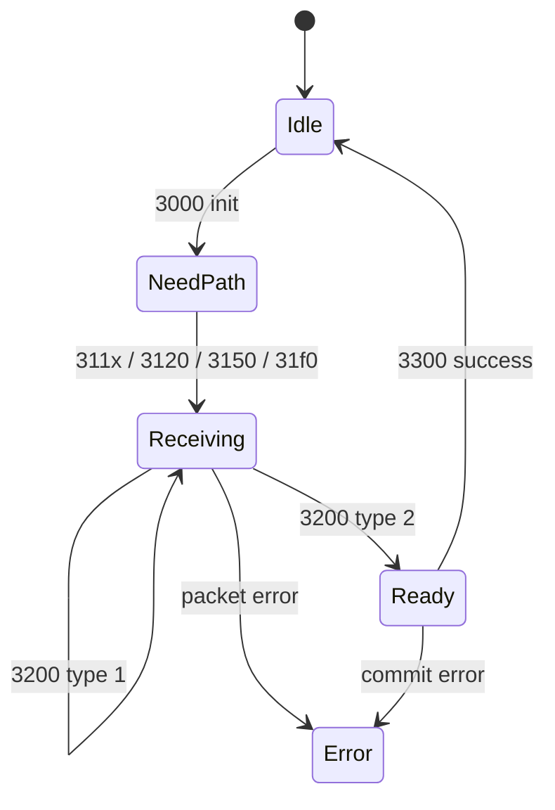

# Elegoo Centauri Carbon 2 stock-camera interaction protocol

**Firmware-specific reverse-engineering reference — updated 2026-09-04**

This document describes every command branch found in the supplied CC2 camera's
Linux maintenance daemon and U-Boot updater. It covers normal-mode USB HID,
bootloader HID, the bootloader's alternate CDC transport, configuration access,
the Linux file-upload service, the upgrade-mode trigger, firmware transfer, and
the absence of any USB flash-read command.

The catalog is complete for the two analyzed binaries. It is not a claim about
other firmware revisions. All multibyte integers are little-endian unless noted.

> **Physical status:** one test completed the in-order bootloader HID transfer,
> full-flash erase/write, normal reboot, video check, and independent three-read
> verification. The preceding normal-mode trigger is not safe: its stock erase
> path can fail and page-program the flag over occupied JFFS2 data. The current
> one-command restore remains unsuitable for end users. See
> [the physical validation record](PHYSICAL-VALIDATION.md).

## 1. Evidence, scope, and confidence

| Artifact | Size | SHA-256 |
|---|---:|---|
| Supplied 8 MiB flash image | 8,388,608 | `269f1b3b205e2ac30ada7cb98a7aeb9ada2e76786dc14abe95ea9c56dce73d1f` |
| Supplied research archive v0.1.0 | 32,904 | `9593b01f3c40085fee6b6d1501538b4a0c2abc93fae0710af5ed25aa5f0d694a` |
| Supplied hardware notes | 4,392 | `7e63ea0ba157b0b6486d4d0f73e26ac09c9e55541fe328e6c71d4dae4babf72e` |
| Extracted `/bin/hid_update` | 19,048 | `bcbdd698b4b9208f73f7ef1f9846b3a96130a1bcc5c118c0e71543cf4e1ed503` |

`/bin/hid_update` is a stripped, little-endian MIPS32r2 ELF with MD5
`8091751fdd4d0d50ea31901663797a86`. Its Linux-side behavior and U-Boot's updater
were reconstructed by static disassembly. The supplied camera image was not
written to physical hardware during this analysis.

Confidence labels used here:

| Label | Meaning |
|---|---|
| Confirmed | Directly represented by code, constants, descriptors, or filesystem data in the supplied image |
| Runtime-unverified | Statically confirmed but not exercised against a physical camera in this work |
| Unknown | Not recoverable with confidence from the supplied image alone |

## 2. System and flash layout

The camera uses two distinct update stages:

1. Linux `/bin/hid_update` handles normal-mode maintenance commands and can set
   two persistent upgrade words.
2. After reboot, SPL sees those words and starts the U-Boot updater, which accepts
   a host-supplied image and writes it to SPI NOR.

The 8 MiB flash map is:

| MTD | Offset | Size | End | Contents |
|---|---:|---:|---:|---|
| `mtd0` | `0x000000` | `0x040000` | `0x040000` | SPL/main U-Boot |
| `mtd1` | `0x040000` | `0x150000` | `0x190000` | Linux uImage |
| `mtd2` | `0x190000` | `0x158000` | `0x2e8000` | root SquashFS |
| `mtd3` | `0x2e8000` | `0x4e8000` | `0x7d0000` | system SquashFS |
| `mtd4` | `0x7d0000` | `0x010000` | `0x7e0000` | plaintext HWCONFIG |
| `mtd5` | `0x7e0000` | `0x020000` | `0x800000` | JFFS2 runtime configuration |

The persistent upgrade words are at flash offset `0x7f8000`, inside `mtd5`.

## 3. USB identities and transports

### 3.1 Normal Linux mode

The active configuration contains:

| Field | Value |
|---|---|
| VID | `0xa108` |
| PID | `0x2240` |
| bcdDevice | `0x0090` |
| Product | `Ingenic HD Web Camera` |
| Manufacturer | `Ingenic Semiconductor Co.,Ltd` |
| Serial | `Ucamera001` |
| `adb_en` configuration | `1` |

The firmware builds a composite camera gadget containing UVC and the maintenance
HID endpoint used by `/bin/hid_update`. ADB is configuration-capable, but the
presence of `adb_en:1` must not be confused with a running daemon; see section 9.

Normal maintenance HID uses report ID `1` and fixed 1,024-byte reports.
`/bin/hid_update` opens `/dev/hidg0` read/write, waits with `select`, and processes
one complete 1,024-byte read at a time. There is no session setup, challenge, or
authentication. Except for the `0x3200` upload sequence field, requests are
independent.

### 3.2 Bootloader HID mode

The U-Boot USB device descriptor is:

```text
12 01 00 02 00 00 00 40 08 a1 08 ff 00 01 00 00 00 01
```

This decodes to USB 2.0, VID `0xa108`, PID `0xff08`, bcdDevice `0x0100`,
64-byte EP0, one configuration, and no USB string descriptors.

The vendor HID report descriptor declares usage page `0xff00`, report ID `1`,
8-bit fields, and report count `0x0bff` (3,071) in each direction. A report is
therefore 3,072 bytes including the report ID. Endpoint addresses and maximum
packet sizes are assigned at runtime and cannot be stated from the template.

### 3.3 Bootloader CDC mode

U-Boot also contains a CDC serial gadget. It feeds the same updater state machine
as HID, so CDC adds no commands. The updater frame is sent directly over CDC,
without the HID report ID or 3,072-byte padding.

The CDC descriptor template contains runtime placeholders, including a zero PID.
The stable CDC PID and endpoint assignments are therefore **unknown** without a
physical enumeration trace.

## 4. Normal-mode HID framing

### 4.1 Report layout

Requests and responses are fixed at 1,024 bytes:

| Offset | Size | Request meaning | Response meaning |
|---:|---:|---|---|
| 0 | 1 | report ID `0x01` | report ID `0x01` |
| 1 | 2 | magic `5a 5a` | magic `5a 5a` |
| 3 | 2 | command | echoed command |
| 5 | 1 | frame type | frame type |
| 6 | 2 | payload length | payload length |
| 8 | 4 | auxiliary value; sequence for `0x3200` | status code |
| 12 | 2 | CRC | CRC |
| 14 | `length` | payload | payload |
| remainder | — | normally zero padding | zero padding |

For valid host traffic, frame type `1` means payload/continuation and frame type
`2` means payload/final. The request parser includes payload in the CRC for both
types. Other frame-type values are not explicitly rejected, but their payload is
not covered by CRC and several handlers still trust `length`; they should not be
used.

The response builder emits a payload only for response frame type `1`. Every
ordinary acknowledgement is type `0`, length zero, with the result in the
32-bit status field.

### 4.2 CRC algorithm

The CRC is a nonstandard reflected use of polynomial `0x1021`:

```python
def cc2_crc16(data: bytes) -> int:
    crc = 0xffff
    for byte in data:
        crc ^= byte
        for _ in range(8):
            old_lsb = crc & 1
            crc >>= 1
            if old_lsb:
                crc ^= 0x1021
    return crc & 0xffff
```

The input is report bytes `0..11`, followed by exactly `length` payload bytes
when request frame type is `1` or `2`. CRC bytes `12..13` and report padding are
excluded. The check vector `b"123456789"` produces `0x1dba`.

The daemon does not bound the declared payload length to the 1,010 bytes remaining
in a report before calculating CRC. Malformed lengths can make it read beyond its
1,024-byte input buffer.

### 4.3 Parser status values

| Status | Meaning |
|---:|---|
| `0` | success |
| `1` | command/handler failure |
| `2` | wrong report ID |
| `3` | wrong magic |
| `4` | CRC mismatch |
| `5` | unknown high-nibble command group |

An unknown command inside a recognized group commonly produces **no response**,
not status `5`. Host software needs a timeout.

### 4.4 Top-level command dispatch

| Command range | Disposition |
|---|---|
| exact `0x0001` | version query |
| other `0x0xxx` | no response |
| any `0x1xxx` | no-op path; no response |
| recognized `0x2xxx` | configuration GET/SET |
| unrecognized `0x2xxx` | no response |
| recognized `0x3xxx` | Linux file upload |
| unrecognized `0x3xxx` | no response |
| **any `0x4xxx`** | set upgrade words and reboot |
| `0x5xxx`–`0xfxxx` | response status `5` |

The `0x4xxx` behavior is group-wide. `0x4000` is the conventional command, but
every command whose high nibble is `4` reaches the same destructive path.

## 5. Complete normal-mode command catalog

### 5.1 Version query

| Command | Request | Success response | Failure |
|---:|---|---|---|
| `0x0001` | No payload required | type `1`, status `0`, first line of `/tmp/version.txt` without newline | status `1` if open/read fails |

The file is opened with mode `r+`. Extra request payload is ignored.

### 5.2 Configuration commands (`0x2xxx`)

Every listed field has an even GET command and the immediately following odd SET
command. These are all configuration commands recognized by this binary:

| GET | SET | Key in `/etc/conf.d/uvc.config` | Present in supplied active config? |
|---:|---:|---|---|
| `0x2000` | `0x2001` | `manufact_lab` | yes |
| `0x2010` | `0x2011` | `serial_lab` | yes |
| `0x2020` | `0x2021` | `productnumber` | no |
| `0x2030` | `0x2031` | `vendor_id` | yes |
| `0x2040` | `0x2041` | `product_id` | yes |
| `0x2050` | `0x2051` | `device_bcd` | yes |
| `0x2f00` | `0x2f01` | `model_lab` | no |
| `0x2f10` | `0x2f11` | `cmei_lab` | no |
| `0x2f20` | `0x2f21` | `appkey` | no |
| `0x2f30` | `0x2f31` | `product_lab` | yes |
| `0x2f40` | `0x2f41` | `adb_en` | yes |
| `0x2f50` | `0x2f51` | `sensor_name` | yes |
| `0x2f60` | `0x2f61` | `i2c_addr` | yes |
| `0x2f70` | `0x2f71` | `default_boot` | yes |
| `0x2f80` | `0x2f81` | `sensor_fps` | yes |
| `0x2f90` | `0x2f91` | `sensor_width` | yes |
| `0x2fa0` | `0x2fa1` | `sensor_height` | yes |
| `0x2fb0` | `0x2fb1` | `hvflip` | yes |
| `0x2fc0` | `0x2fc1` | `rcmode` | yes |
| `0x2fd0` | `0x2fd1` | `bitrate` | yes |
| `0x2fe0` | `0x2fe1` | `qp_value` | yes |

GET semantics:

- Request payload is ignored.
- The daemon scans `/etc/conf.d/uvc.config`, splits each candidate line at `:`,
  trims the key at its first space, and returns the raw value bytes between the
  colon and newline.
- Success is response type `1`, status `0`, with the value as payload.
- A missing key, open error, or parse error returns status `1`.

SET semantics:

- Send the replacement value as request payload using frame type `1` or `2`.
- The daemon rewrites the matching line, preserving the original key/padding and
  replacing the bytes after the colon.
- It buffers the remainder of the file, writes the replacement line and then
  restores that tail. If the result is shorter than the old file, it zero-pads
  back to the old length instead of truncating, so shorter values can leave NUL
  bytes at the end of the configuration file.
- Success is response type `0`, status `0`; failure is status `1`.
- There is no type, range, encoding, or semantic validation.
- Changes affect the JFFS2 runtime copy. The boot script copies the SquashFS
  default only if the runtime file is absent.
- The implementation uses small fixed stack buffers and does not adequately
  constrain lengths. Values should be short textual strings.

Keys absent from the active file still have handlers, but GET/SET fails until a
matching line exists. Unlisted configuration keys such as `gop`, `qp_reform`,
audio fields, and UVC format fields have no HID command in this binary.

### 5.3 Linux arbitrary-file upload commands (`0x3xxx`)

This family is host-to-camera only. It has no download or file-read operation.

Internal states are:

| State | Meaning |
|---:|---|
| `1` | idle |
| `2` | buffer allocated; destination required |
| `3` | receiving file data |
| `4` | final packet received; ready to commit |
| `5` | error |



All 13 recognized commands are:

| Command | Required state | Operation | Normal next state |
|---:|---:|---|---:|
| `0x3000` | `1` | initialize; allocate `0x01000200` bytes (16 MiB + 512), zero counters | `2` |
| `0x3110` | `2` | select destination path from request payload | `3` |
| `0x3111` | `2` | select destination path from request payload | `3` |
| `0x3112` | `2` | select destination path from request payload | `3` |
| `0x3113` | `2` | select destination path from request payload | `3` |
| `0x3114` | `2` | derive `/system/lib/modules/sensor_%s_t31.ko` using configured `sensor_name` | `3` |
| `0x3115` | `2` | derive `/system/etc/sensor/%s-t31.bin` using configured `sensor_name` | `3` |
| `0x3116` | `2` | select destination path from request payload | `3` |
| `0x3120` | `2` | select destination path from request payload | `3` |
| `0x3150` | `2` | select destination path from request payload through a separate but equivalent handler | `3` |
| `0x31f0` | `2` | select destination path from request payload | `3` |
| `0x3200` | `3` (also erroneously accepts `5`) | append numbered payload data | `3` or `4` |
| `0x3300` | `4` (also erroneously accepts `5`) | remove old path, write accumulated file, chmod `0777` | `1` |

Destination selection details:

- Payload bytes are copied into a shared 128-byte path buffer.
- The path is terminated at the first ASCII space.
- There is no adequate length check before the copy; valid producers should use
  at most 127 bytes and avoid spaces.
- The numeric distinctions among the payload-path commands do not change their
  behavior in this build. Their original vendor meanings are unknown.

`0x3200` data packets use the normal report fields as follows:

| Normal-report field | Meaning |
|---|---|
| command | `0x3200` |
| frame type `1` | more packets follow |
| frame type `2` | final packet |
| auxiliary value at offset 8 | absolute 32-bit packet sequence |
| payload | file bytes to append |

Sequences `0` and `1` are accepted specially. For sequence values `>=2`, the
value must equal the last accepted sequence plus one. The daemon checks that the
cumulative byte count does not exceed `0x01000200`. On a sequence or capacity
error it returns status `1`, frees the buffer, clears its pointer, and enters
state `5`. The state dispatcher nevertheless permits later data/commit calls in
state `5`; this is a firmware bug and is unsafe to exercise.

`0x3300` commit behavior is:

1. Require the final-packet flag.
2. Execute `rm <path>` through the shell, then `sync`.
3. Open `<path>` as `wb` and write exactly the accumulated bytes.
4. Execute `chmod 0777 <path>` through the shell.
5. If the target is exactly `/system/bin/hid_update`, copy the old executable to
   `/system/bin/hid_update_bak` before replacement.
6. Free the upload buffer and return status `0`, state `1` on success.

The remove and chmod commands interpolate the host-controlled path without shell
quoting. Truncation at the first space does not neutralize shell metacharacters.
The protocol has no authentication, signature, hash, atomic replacement, or
readback. It can overwrite persistent configuration or executable files and
should never be exposed to an untrusted USB host.

For recognized commands issued in the wrong state, the dispatcher usually
returns status `0` while doing nothing. Host software must track the state rather
than treating status `0` as proof of an action.

### 5.4 Upgrade-mode trigger (`0x4xxx`)

The conventional HID-mode request uses command `0x4000`, frame type `1`, and
exactly eight payload bytes:

```text
54 44 50 55 a1 03 02 01
```

These are two words:

```text
word0 = 0x55504454
word1 = 0x010203a1
```

The complete meaningful prefix of the 1,024-byte request, including CRC, is:

```text
01 5a 5a 00 40 01 08 00 00 00 00 00 f8 0e
54 44 50 55 a1 03 02 01
```

The remainder is zero padding.

The daemon copies the caller-declared payload length but submits a fixed eight-byte
driver request, so any length other than eight is unsafe. It opens `/dev/ucamera`,
writes the two words to flash offset `0x7f8000` with ioctl `0x2000550c`, then
internally reads the same eight bytes with ioctl `0x2000550d`. That read is only
used for local logging and is never returned to the USB host.

On successful write it replies status `0`, then calls `reboot`. On write failure
it replies status `1` but still follows the reboot path. The response echoes the
actual `0x4xxx` command received.

SPL checks `word0`. Main U-Boot interprets `word1` as:

| `word1` | Transport |
|---:|---|
| `0x010203a0` | CDC |
| `0x010203a1` | HID |
| any other value | HID default |

If Linux starts while `word0` still equals `0x55504454`, `/bin/hid_update` clears
both words to `0xffffffff` during daemon startup.

#### Physical trigger failure

On the tested camera, `0x7f8000` contained the JFFS2 cleanmarker prefix
`85 19 03 20 0c 00 00 00`. The daemon's erase attempt failed, after which its
page program produced the bitwise-AND result
`04 00 00 00 00 00 00 00` instead of the requested words. SPL therefore read
`0x00000004, 0x00000000` and booted Linux normally.

Runtime errors and exact-kernel disassembly agree on the cause: the SFC driver
was configured internally for `0x4000`-byte erases, but its sector-erase routine
selects opcodes only for `0x1000`, `0x8000`, and `0x10000`. A boot-specific live
RAM experiment changed that internal value to `0x1000`; ordinary 16 KiB MTD
erase requests were then successfully subdivided into 4 KiB sector erases.
That dynamic address and mounted-JFFS2 experiment are not a portable procedure.

## 6. Bootloader updater protocol

### 6.1 HID envelope

A bootloader HID OUT report is:

| HID offset | Size | Meaning |
|---:|---:|---|
| 0 | 1 | report ID `0x01` |
| 1 | variable | updater frame described below |
| remainder | — | padding to exactly 3,072 bytes |

IN reports have the same envelope. Use the embedded frame length; HID padding is
not checksummed. Over CDC, send and receive only the embedded updater frame.

### 6.2 Common updater frame

Host-to-device magic is `80 00 ee`; device-to-host magic is `81 00 ee`.

| Frame offset | Size | Meaning |
|---:|---:|---|
| 0 | 3 | direction-specific magic |
| 3 | 1 | frame type |
| 4 | 2 | total frame length, including final checksum |
| 6 | variable | payload |
| `length - 1` | 1 | additive checksum |

The checksum is `sum(frame[0:length-1]) & 0xff`. The smallest well-formed producer
frame is seven bytes. The parser uses the length supplied in the frame and does
not provide a general command namespace. Type-3 frames are checksum-validated;
the type-1 metadata path calls the same validator but mistakenly ignores its
return value, as detailed below.

All observed frame types are:

| Type | Direction | Payload | Meaning |
|---:|---|---|---|
| `1` | host → device | exactly 10 bytes | initialize firmware transfer |
| `2` | device → host | 4-byte LE integer | ACK: next expected absolute packet number |
| `3` | host → device | 4-byte sequence + data | numbered transfer data |
| `5` | device → host | one byte | terminal success (`01`) or failure (`00`) |

Only host types `1` and `3` reach the updater state machine. There is no host
type for command dispatch, flash read, memory read, query, cancel, or reboot.

### 6.3 Type-1 transfer metadata

A canonical type-1 frame is 17 bytes:

| Payload offset | Size | Meaning |
|---:|---:|---|
| 0 | 2 | maximum transfer-data bytes per type-3 frame (`subpack_size`) |
| 2 | 4 | total transfer-stream size, including the 128-byte image header |
| 6 | 2 | data packets accumulated per ACK (`packets_per_ack`) |
| 8 | 2 | firmware version; parsed/logged but not used for acceptance |

U-Boot calculates:

```text
frame_size   = subpack_size + 11
packet_count = ceil(transfer_size / subpack_size)
batch_size   = frame_size * packets_per_ack
batch_count  = ceil(packet_count / packets_per_ack)
```

It allocates a buffer for the entire `transfer_size` plus buffers used to assemble
a batch. Allocation failure prevents normal progress. On success the device sends
type `2` with payload `00 00 00 00`, meaning packet zero is next.

Malformed-metadata handling is weak. After checking the three-byte magic and the
type byte, the state machine unconditionally copies ten payload bytes. It neither
requires total length 17 nor acts on the checksum validator's result. It also
does not reject zero `subpack_size`/`packets_per_ack` before division or impose a
safe upper bound on `transfer_size` before allocation. A valid host must use a
17-byte, correctly checksummed frame with both divisors nonzero and a transfer
size consistent with the intended flash image.

For HID, a practical maximum is `subpack_size = 3060`: six common-header bytes,
four sequence bytes, 3,060 transfer bytes, and one checksum byte make a 3,071-byte
embedded frame; adding the HID report ID makes 3,072.

### 6.4 Type-3 data and ACK semantics

| Type-3 payload offset | Size | Meaning |
|---:|---:|---|
| 0 | 4 | absolute, zero-based packet number |
| 4 | up to `subpack_size` | consecutive transfer-stream bytes |

Packet numbers must be consecutive. U-Boot validates each frame's magic and
additive checksum and copies the data portion into the complete transfer buffer.
At each configured batch boundary it sends a type-2 ACK.

The ACK's four-byte payload is **not a constant**. It is:

```text
u32le(next packet number the device expects)
```

Examples when `packets_per_ack = 1`:

| Event | Type-2 ACK payload |
|---|---|
| metadata accepted | `00 00 00 00` |
| packet 0 accepted and more data remains | `01 00 00 00` |
| packet 1 accepted and more data remains | `02 00 00 00` |
| device requests retransmission beginning at packet 7 | `07 00 00 00` |

The final packet does not receive a type-2 ACK. It leads to MD5 validation and a
type-5 terminal status.

On an invalid frame or sequence, U-Boot resets accumulation to the start of the
current batch and sends an ACK containing that batch's first expected packet.
The error counters eventually produce type `5`, payload `00`; the bad-frame path
tolerates four errors and fails on the next, while the stalled-transfer helper
aborts when its retry counter reaches five. Exact wall-clock timing depends on
the gadget main loop and remains runtime-unverified.

Using `packets_per_ack = 1` minimizes retransmission ambiguity. A host should
still treat the ACK value as authoritative and resend from the requested absolute
packet number when necessary.

### 6.5 Transfer stream and 128-byte image header

The bytes carried by type-3 frames form one logical stream:

| Stream offset | Size | Meaning |
|---:|---:|---|
| 0 | 4 | ignored by this U-Boot build |
| 4 | 4 | target SPI flash offset |
| 8 | 4 | image length |
| 12 | 16 | binary MD5 of image bytes |
| 28 | 100 | ignored by this U-Boot build |
| 128 | `image_length` | bytes to erase/write |

For a valid producer, metadata `transfer_size` is `128 + image_length`. After the
last packet, U-Boot computes MD5 across exactly `image_length` bytes starting at
stream offset 128 and compares all 16 bytes to the header. It does not explicitly
cross-check the header length against the metadata allocation; a malformed larger
`image_length` can make the MD5 path read beyond the received transfer buffer.

On MD5 mismatch, it sends type `5` with payload `00` and does not enter the
erase/write path. On MD5 match, it sends type `5` with payload `01`, waits about
200 ms, then calls:

```text
erase(flash_offset, image_length)
write(flash_offset, image_length, transfer_buffer + 128)
```

The success byte proves only that the **received RAM image** matched its header.
It is transmitted before erase/write. This U-Boot build does not:

- check that `flash_offset + image_length <= 0x800000`;
- check the erase or write return values;
- read the programmed flash back;
- authenticate or verify a signature; or
- preserve partitions outside the requested range automatically.

Host software must enforce the 8 MiB limit and any partition policy. A full-image
write naturally replaces the persistent words at `0x7f8000`. A partial write can
leave the upgrade flag set and produce an update-mode boot loop.

## 7. End-to-end host sequence

A correct HID-mode flow is:

1. Enumerate normal HID `a108:2240` and exchange 1,024-byte reports.
2. Send a valid `0x4000` request with the exact eight-byte HID trigger payload.
3. Read status `0`; expect USB disconnect/reboot.
4. Enumerate bootloader HID `a108:ff08`.
5. Construct the 128-byte image header and split the complete stream into at most
   3,060-byte chunks.
6. Send type-1 metadata; require type-2 ACK value `0`.
7. Send numbered type-3 packets. At every nonfinal batch boundary, parse the
   type-2 ACK as the next expected absolute packet number.
8. After the final packet, require type-5 payload `01` for received-data MD5.
9. Do not treat that byte as programmed-flash verification. Allow time for
   erase/write and reboot before looking for normal mode.
10. Verify flash through an independent read path if one is available.

No protocol-level operation can safely cancel a transfer or clear the persistent
flag once the camera is in U-Boot update mode. Power loss during erase/write may
brick the camera.

## 8. Commands that do not exist

Exhaustive control-flow review found no USB-accessible operation for:

- reading SPI flash in Linux maintenance HID;
- reading SPI flash in U-Boot HID or CDC;
- downloading a Linux file through `0x3xxx`;
- querying U-Boot updater status beyond ACK/terminal status;
- verifying programmed flash;
- erasing without a subsequent write;
- selecting a named MTD partition; or
- authenticating a host or image.

Generic SPI read functions exist elsewhere in U-Boot for boot and console use,
but no updater branch calls them on behalf of USB. Linux ioctl `0x2000550d` reads
only the fixed eight-byte upgrade-word request and does not return those bytes to
the host.

## 9. Readback and guarded ADB startup

The root filesystem contains `/bin/adbd`, and the UVC configuration contains
`adb_en:1`, but the default persistent config does not directly launch the
daemon. Setting `adb_en` alone does not execute it.

The root SquashFS `/etc/init.d/rcS` supplies the missing boot mechanism. It:

1. locates the MTD partition named `config`;
2. mounts its JFFS2 filesystem at `/etc/conf.d`;
3. executes `/etc/conf.d/system.sh` if that file exists; and
4. only afterward mounts `/system` and launches `/home/bashrc.sh`.

Because `/bin/adbd` is in the root filesystem, a persistent `system.sh` whose
exact contents are `/bin/adbd &` starts the daemon at the next boot. The device
owner runtime-verified this by manual file creation. The boot hook and binary
location are independently confirmed in the supplied image.

The client exposes the two startup mechanisms as separate `start-adb` and
`install-adb-startup` commands. `backup` does not enter either path. Without any
setup, the stock gadget always exposes an ADB USB transport without a running
daemon, so the pre-daemon host state is `Ucamera001 offline`, not an absent
device. Only temporary `start-adb` accepts that offline state or an absent selected
ADB device as a reason to attempt HID startup. Persistent `install-adb-startup`
requires already-online root ADB and a preserved backup. A missing local ADB executable,
timeout, multiple or unauthorized devices, a non-root shell, malformed
partition map, failed/short read, or unstable acquisition remains a refusal.

The stock daemon implements legacy ADB `shell` and sync/`pull`, but rejects the
newer `exec-out` service with `error: closed`. The client therefore uses `shell`
only for textual `id` and `/proc/mtd` results, removing the doubled carriage
returns observed on Windows before parsing. It pulls each `/dev/mtdN` through
ADB sync into a fresh private host file, requires the exact validated partition
size, concatenates in MTD order, and deletes the temporary directory. It makes
at most five complete attempts and accepts only three consecutive byte-identical
8 MiB images. A nonconsecutive three-of-five majority is not accepted. It never
sends binary flash data through the terminal-oriented shell service.

This choice is runtime-grounded: on Windows 11 with ADB 35.0.2, a live
`adb pull /dev/mtd4` returned exactly 65,536 bytes. Its local MD5
`56392b3d32797a089432c7b633ef921f` matched `md5sum /dev/mtd4` on the camera.

### 9.1 Temporary upload-command start

`cc2camera start-adb` uses two confirmed bugs without weakening
the general upload-path API:

1. literal targets are truncated only at the first ASCII space; and
2. commit interpolates the remaining host-controlled target into unquoted
   `system("rm %s")` before calling `fopen(target, "wb")`.

The client sends this exact sequence:

| Step | Command | Frame details | Effect |
|---:|---:|---|---|
| 1 | `0x3000` | type `1`, empty payload | allocate/reset upload state |
| 2 | `0x3110` | type `1`, payload `/tmp/.cc2flash-adbd-bootstrap;/bin/adbd&` | select immutable no-space injection target |
| 3 | `0x3200` | type `2`, sequence `0`, payload one newline byte | mark upload final/ready |
| 4 | `0x3300` | type `1`, empty payload | execute injected `rm` shell line, then reach expected failing literal open |

At step 4 the first shell command is exactly:

```sh
rm /tmp/.cc2flash-adbd-bootstrap;/bin/adbd&
```

The `rm` side addresses tmpfs and `/bin/adbd` is launched once in the
background. The subsequent literal path contains `/bin/adbd&` below a normally
nonexistent `/tmp/.cc2flash-adbd-bootstrap;` directory, so `fopen` fails and the
later unquoted `chmod` is not reached. This produces a normal status-1 commit
reply; USB gadget changes may instead remove HID before the reply is readable.
The client accepts failure/timeout/disconnection only for that final exchange.
Live Windows testing confirmed that `/bin/adbd` starts and accepts `adb shell`,
but also showed that the old ADB transport can close during the USB transition;
in that case `adb wait-for-device` exits immediately with `error: closed`.
The client therefore polls the selected device until it is online, tolerating
only absent, stock `offline`, and exact `error: closed` transition states within
the bounded startup timeout. Each `adb get-state` subprocess is capped at the
remaining deadline; non-positive, infinite, and NaN durations are rejected
before HID is sent. An ADB subprocess timeout is a hard failure rather than a
fourth retryable transition state. The command validates root ADB and exits;
the user then runs the separate, strictly read-only `backup` command.

No persistent startup file is created. The handler still executes `sync` after
the shell command, so normal firmware writes already pending against JFFS2 may
be flushed; this mechanism specifically avoids adding the known
`/etc/conf.d/system.sh` mutation rather than promising a quiescent flash.

The uploader enters error state after the expected failed commit. If ADB does
not appear, another attempt may require rebooting the camera to reset the
uploader state.

### 9.2 Persistent startup hook

The supported command is `cc2camera install-adb-startup --backup BACKUP.zip`.
It requires already-online root ADB, a preserved same-camera backup, three
consecutive stable live reads and sufficient clean config space. Consent is
`ENABLE-ADB` or explicit `--yes`.

It stages and reads back files in tmpfs, then installs the shared
`/etc/conf.d/system.sh` runner and `enabled/90-adb.sh` through ADB filesystem
operations. It verifies persistent bytes and permissions. Different contents at
`system.sh` or the selected `enabled/90-adb.sh` path are refused, not overwritten.
Unrelated regular hooks in `enabled/` remain and execute in filename order.
No HID upload transaction is used.
Restart manually after success. For offline ADB, first run `start-adb`, then
`backup`. See [startup hooks](../docs/STARTUP-HOOKS.md).

### 9.3 Stable-read and boot-hash gates

Only after the three-read stability gate passes does `backup` fingerprint the
full 256 KiB `boot` partition. The built-in known reference is:

```text
5602ec961b4410ccceea0d4910e4fa768c6998bd4ba86143ba50855bdd0b7a54
```

If the stable image has a different boot SHA-256, the command publishes no
backup and prints that exact observed value. The user may independently review
it and rerun with `--accept-bootloader-sha256 <observed-sha256>`. A supplied hash
that differs from the newly observed partition is rejected. The accepted v2
manifest records whether the basis was `known-reference` or `explicit-hash`.
The raw image and manifest are published as exactly two members of one ordinary
ZIP, `flash.bin` and `manifest.json`. The client completes, flushes, and
CRC-checks a same-directory temporary archive before an atomic create-if-absent
hard link exposes the final `.zip`. The publication step cannot overwrite a
destination created concurrently, and it cannot expose only one half of the
image/evidence pair. Restore rejects additional/duplicate/encrypted members,
unsupported compression, the wrong advertised image size, oversized or
non-object JSON, decoder-limit failures from overlong integers or excessive
nesting, malformed or impossible counters, hash mismatches, and legacy manifest
formats before enabling a write.

After a restore returns to normal-mode USB, `--adb-timeout` bounds only the wait
for the selected daemon to become online. The three-consecutive-read verification
then runs as a separate phase with the normal per-command timeouts. This avoids
misrepresenting a short ADB-availability window as a bound on as many as thirty
partition pulls.

Persistent hook installation writes config files and requires its backup before
mutation. Normal HID offers no file download/readback; it is used only by the
separate temporary ADB-start mechanism described above, not the hook installer.

## 10. Client compatibility status

| Component | Current client behavior | Firmware behavior | Status |
|---|---|---|---|
| Bootloader data ACK | parses `u32le(next_expected_packet)` and requires the next in-order value; aborts on retry request | payload is the next expected packet, including a batch restart after an error | In-order 2,742-packet physical transfer passed; retransmission remains unimplemented and untested |
| Persistent ADB start | guarded ADB command installs shared runner and ADB hook after backup and space checks | `rcS` executes the persistent hook next boot | Offline-tested; shared runner and persistent ADB physically verified on one camera |
| Temporary ADB start | separate command sends an immutable no-space upload target, tolerates only final-commit failure/disconnect, and polls across the old transport closing | unquoted `rm` target starts `/bin/adbd`; literal `fopen` then fails | Physical startup and root shell verified on Windows |
| Backup acceptance | requires three consecutive identical full reads within five attempts, gates on the known or explicitly accepted boot hash, and publishes one verified ZIP | ADB sync/`pull` can read each raw MTD device | Complete 8 MiB live acquisition verified; strengthened read/archive policy is offline-tested |
| Public Python catalog | exposes all 57 exact normal commands, every `0x4xxx` match, and boot types 1/2/3/5 with builders/decoders | complete analyzed dispatcher/state-machine surface | Implemented with source comments and exhaustive offline mapping tests |

The protocol builder, MD5 header, packet numbering, and bootloader transfer are
consistent with the analyzed code and the one-camera physical result. Restore
is still not hardware-ready because the normal-to-boot trigger has a confirmed
erase failure, retransmission remains unimplemented, and no uninterrupted
workaround has been physically validated.

## 11. Static-analysis anchors

These addresses make the findings reproducible. Linux addresses are ELF virtual
addresses. The main U-Boot image starts at flash file offset `0x6800`, linked at
`0x80100000`; for it, `VA = file_offset - 0x6800 + 0x80100000`.

| Function/data | Address |
|---|---:|
| Linux response builder | `0x00401034` |
| Linux parser/top-level dispatcher | `0x0040123c` |
| Linux HID handler thread | `0x004017d4` |
| configuration GET | `0x00401cd0` |
| configuration SET | `0x00402038` |
| configuration dispatcher | `0x004024c0` |
| upload initialization | `0x00402830` |
| upload packet append | `0x004028dc` |
| upload commit | `0x004029f0` |
| sensor-derived path builder | `0x00402ba8` |
| upload dispatcher | `0x00402e3c` |
| SPL upgrade-word read | `0xf0001c28` |
| SPL `0x55504454` comparison | `0xf0001c54` |
| U-Boot host-frame validator | `0x80117948` |
| U-Boot device-frame builder | `0x801179ec` |
| U-Boot retry/ACK helper | `0x80117b28` |
| U-Boot updater state machine | `0x80117d1c` |
| U-Boot SPI updater initialization | `0x801186ac` |
| U-Boot transport selection | `0x80118714` |
| U-Boot MD5 routine | `0x80119620` |
| U-Boot HID report envelope | `0x8011b9d8` |

## 12. Runtime uncertainties

The following remain hardware-unverified or unknown:

- the bootloader CDC PID and exact serial endpoint configuration;
- host HID API differences on systems other than the tested Windows host;
- retransmission behavior after a physical retry request;
- a safe uninterrupted normal-Linux-to-U-Boot entry procedure;
- general erase/write behavior and failure reporting beyond the one successful
  full-image write;
- whether other CC2 camera firmware revisions use the same commands; and
- any board-level recovery behavior associated with the `BSL0` pad.

These uncertainties do not change the command catalog, ACK semantics, lack of
bootloader USB readback, the physically observed trigger failure, or the unsafe
success-before-write behavior.
